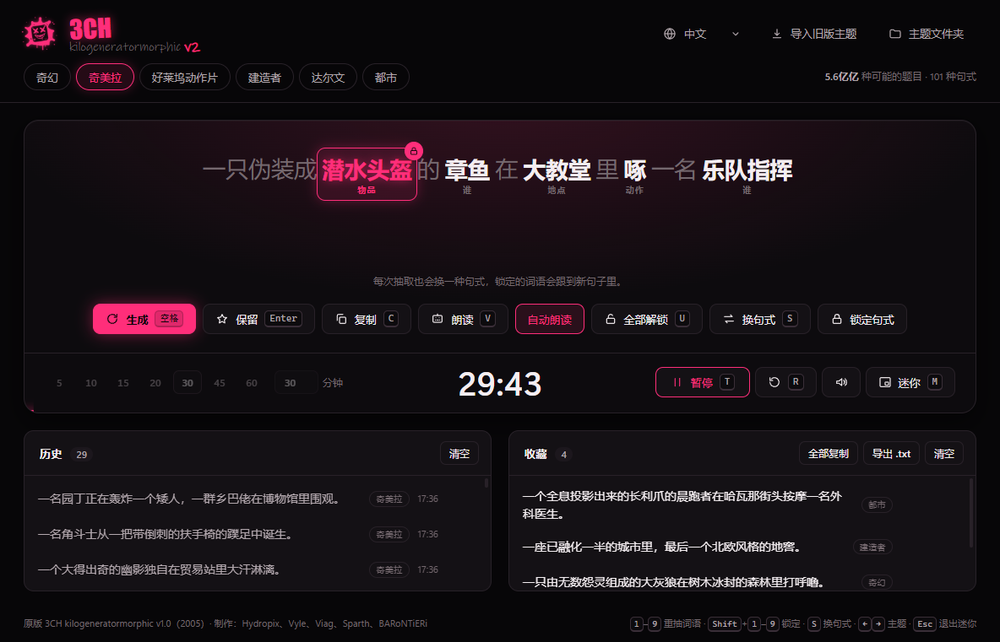

https://github.com/user-attachments/assets/6ad86c5e-5fcb-4526-ba17-81c438e555da

<p align="center">
  <b>Random subject generator for concept art and speed painting</b><br>
  with a built-in speed painting timer
</p>

<p align="center">
  <b>概念设计与速涂随机题目生成器，自带速涂计时器，支持简体中文</b> · <a href="#中文说明">中文说明</a><br>
  <sub>English · Français · 中文</sub>
</p>

<p align="center">
  <a href="https://github.com/hydropix/3CH/actions/workflows/build.yml"></a>
  <a href="https://github.com/hydropix/3CH/releases/latest"></a>
  <a href="LICENSE"></a>
</p>

## ⬇️ Download

<p align="center">
  <a href="https://github.com/hydropix/3CH/releases/latest/download/3CH-Setup.exe"></a>
  &nbsp;
  <a href="https://github.com/hydropix/3CH/releases/latest/download/3CH-mac.dmg"></a>
</p>

<p align="center">
  No install on Windows? Get the <a href="https://github.com/hydropix/3CH/releases/latest/download/3CH-Portable.exe"><b>portable version</b></a>, which runs from anywhere, even a USB stick.<br>
  <sub>The buttons always download the latest version. See every version on the <a href="https://github.com/hydropix/3CH/releases">Releases page</a>. The builds are made automatically by GitHub Actions from this repository.</sub>
</p>

<details>
<summary><b>First launch: "Windows protected your PC" / "Apple could not verify 3CH"</b></summary>

The builds are not signed with a paid code-signing certificate, so the system warns
you the first time.

- **Windows**: in the SmartScreen dialog, click **More info**, then **Run anyway**.
- **macOS**: open the `.dmg` and drag 3CH into **Applications**. Try to open it
  once, then go to **System Settings → Privacy & Security** and click
  **Open Anyway** next to the 3CH message. Or, in Terminal:
  ```bash
  xattr -dr com.apple.quarantine /Applications/3CH.app
  ```
</details>

<p align="center">
  
</p>


## What it does

Press **Space** and 3CH gives you a subject to paint:

> *A tight altar area with protruding radiating pillars and bumpy translucent platforms.*

> *A headless frog crosses iron with a chameleon in a field of meteorites.*

> *While a wild boar crashes to pieces, a nauseous old god dissects the tentacles of a penguin.*

It also speaks French and Chinese:

> *Une mouche abyssale jaillit d'une idole sur la tombe d'un géant.*

> *一只橡皮鸭和一只海马在盐矿里互相用头撞对方。*

- **English, French and Chinese**: pick the language in the top bar
  (**English** / **Français** / **中文**). It changes the themes, the interface
  and the voice at once, and your choice is saved. The first time, 3CH follows
  the language of your system. Switching keeps the same theme in the other
  language. In French, adjectives and articles agree with the noun ("une
  plante carnivore minuscule"), and "le arbre" becomes "l'arbre". In Chinese
  (Simplified), every noun gets its measure word (一只狼, 一条龙), and it
  follows the noun when you reroll it.
- **6 themes** in each language: Fantasy, Urban, Hollywood action, Darwin
  (creatures), Constructor (environments) and Chimera.
- **Every roll changes the shape of the sentence**, not only the words: over
  30 sentence shapes per theme, 99 for Chimera, which mixes the words of every
  theme so nothing makes sense except the grammar. Locked words follow into the
  next shape, **Reshape** keeps the words and changes the shape, and **Lock
  shape** keeps the shape.
- **Click a word to reroll only that word**, or lock it to keep it while
  everything else changes.
- **Keep** the subjects you like. They stay saved, and you can copy them or export
  them to a `.txt` file. The last 100 rolls are in the history.
- **A broken robot voice** reads the subject aloud: the system's own voice,
  vocoded, stuttering and glitching differently every time. **Speak** reads it,
  **Auto voice** (on by default) reads every new subject as soon as it is
  rolled. It reads the subject in the language of its theme. For French or
  Chinese speech, install a voice of that language in Windows (Settings →
  Time & language → Speech → Add voices). Without one, the default voice reads
  French text with an English accent, and stays silent on Chinese (3CH tells
  you so once).
- **Speed painting timer** (5 to 60 min, or any length up to 4 hours):
  - The time left shows in the taskbar.
  - A very soft tick on every minute, a beep for the last one, and a chime
    plus a notification at the end.
  - The same robot voice runs the session like a passive-aggressive lab AI:
    it announces the time left, puts on the pressure, counts down from 10 and
    calls the end, in the language of the interface. The sound button mutes
    it with the other alerts.
- **Mini mode**: a small always-on-top window with just the subject and the
  clock, so they stay in sight over Photoshop, Krita or Procreate.

<p align="center">
  
</p>

### Shortcuts

| Action | Key |
|---|---|
| New subject | `Space` |
| Reroll word 1 to 9 / lock it | `1`–`9` / `Shift` + `1`–`9` |
| Keep / copy the subject | `Enter` / `C` |
| Read the subject aloud / auto voice on or off | `V` / `Shift` + `V` |
| Unlock every word | `U` |
| New sentence shape, same words | `S` |
| Previous / next theme | `←` `→` |
| Start or pause the timer / reset it | `T` / `R` |
| Mini window / leave it | `M` / `Esc` |

## 中文说明

**3CH** 是一款为概念设计和速涂准备的随机题目生成器，自带速涂计时器，完全免费、开源。按下**空格键**，它就给你一个要画的题目：

> *一只伪装成潜水头盔的章鱼在大教堂里啄一名乐队指挥。*

> *一只长着六条腿的鸡教一条海龙怎么扛起一只吸血蝙蝠。*

<p align="center">
  
</p>

- **完整的简体中文版**：在顶部栏的语言菜单里选择 **中文**，界面、主题和语音会一起切换。第一次启动时，3CH 会跟随系统语言。
- **6 个中文主题**：奇幻、都市、好莱坞动作片、达尔文（生物）、建造者（场景）和奇美拉（混搭所有主题的词语，除了语法什么都说不通）。每个主题有上千个词语和 35 到 101 种句式，量词会自动跟着名词变（一只狼、一条龙、一座城堡）。
- **每次抽取都会换一种句式**，不只是换词。**点击词语**只重抽这一个词，**右键**锁定它，锁定的词会留到下一个句子里。
- **保留**喜欢的题目，可以复制或导出为 `.txt` 文件，最近 100 次抽取都在历史记录里。
- **坏掉的机器人声音**会朗读题目，速涂时还有一个阴阳怪气的实验室 AI 为你报时、施压、倒数。朗读中文需要系统里有中文语音：Windows 设置 → 时间和语言 → 语音 → 添加语音 → 中文（简体）。
- **速涂计时器**（5 到 60 分钟，或自定义，最长 4 小时），以及始终置顶的**迷你窗口**，画画时题目和时间一直在眼前。
- 快捷键和上面的表格相同：空格生成，`1`–`9` 重抽词语，`S` 换句式，`T` 开始计时，`M` 迷你窗口。

**下载**：[Windows 安装版](https://github.com/hydropix/3CH/releases/latest/download/3CH-Setup.exe) · [Windows 便携版](https://github.com/hydropix/3CH/releases/latest/download/3CH-Portable.exe)（免安装，U 盘也能用） · [macOS](https://github.com/hydropix/3CH/releases/latest/download/3CH-mac.dmg)

程序没有付费的代码签名证书，所以第一次打开时系统会提示：

- **Windows** 显示“Windows 已保护你的电脑”：点击 **更多信息**，再点击 **仍要运行**。
- **macOS** 提示无法验证 3CH：先尝试打开一次，然后进入 **系统设置 → 隐私与安全性**，点击 3CH 旁边的 **仍要打开**。

## Make your own themes

A theme is a small JSON file: the sentence structure plus word lists, with
optional weights, or several structures like the bundled themes. A theme
says its language (`"lang": "fr"`) and shows up under that language in the
top bar. Themes in a language with genders can link words so that adjectives
and articles agree with the noun, and Chinese themes give each noun its
measure word. Drop it in the folder opened by
**Themes folder**, or use **Import legacy theme** to convert a theme folder
from the original 2005 app. See [app/README.md](app/README.md) for the format.

## Build from source

```bash
cd app
npm install
npm start          # run
npm test           # tests
npm run dist:win   # build Windows installers into app/dist
npm run dist:mac   # build the macOS .dmg (on a Mac)
```

To publish a new version:
1. Bump `version` in `app/package.json` (`npm version 2.x.y --no-git-tag-version` in `app/`).
2. Add a `## [2.x.y]` section to [CHANGELOG.md](CHANGELOG.md). It becomes the release notes.
3. Commit, then tag and push. GitHub Actions builds both platforms and attaches them to a new release:

```bash
git tag v2.x.y
git push origin v2.x.y
```

## History

3CH, the *kilogeneratormorphic*, started in 2005 as a small .NET tool shared
between concept artists. The original app and its word lists are kept as they
were in [`Legacy/`](Legacy). Version 2 is a rebuild with the same themes. It
fixes the original data-parsing bugs and adds rerolling and locking single
words, kept subjects, the timer and mini mode.

**Original credits:** Hydropix, Vyle, Viag, Sparth, BARoNTiERi. They wrote the
original app and all the word lists that the themes are built from. See
[CREDITS.md](CREDITS.md).

## License

[MIT](LICENSE) © Hydropix and the 3CH contributors. The word lists (in `Legacy/`
and `app/themes/`) are by the original 3CH team: please keep their credit when
you reuse them ([CREDITS.md](CREDITS.md)).
