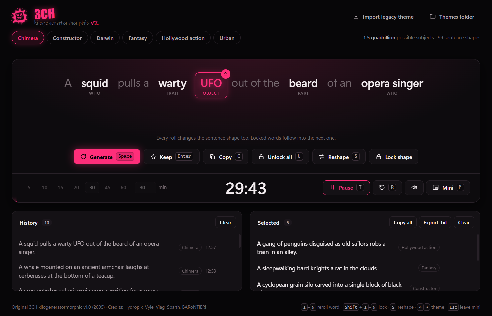
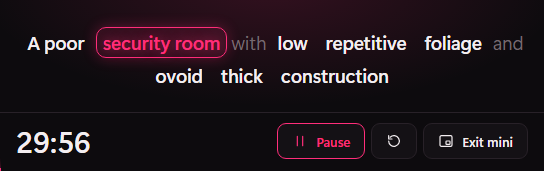

<p align="center">
  
</p>

<h1 align="center">3CH</h1>

<p align="center">
  <b>Random subject generator for concept art and speed painting</b><br>
  with a built-in speed painting timer
</p>

<p align="center">
  <a href="https://github.com/hydropix/3CH/actions/workflows/build.yml"></a>
  <a href="https://github.com/hydropix/3CH/releases/latest"></a>
  <a href="LICENSE"></a>
</p>

## ⬇️ Download

| | Download | Notes |
|---|---|---|
| **Windows** | [**3CH-Setup.exe**](https://github.com/hydropix/3CH/releases/latest/download/3CH-Setup.exe) | Installer, Windows 10 / 11 (64-bit) |
| **Windows** | [**3CH-Portable.exe**](https://github.com/hydropix/3CH/releases/latest/download/3CH-Portable.exe) | No install: run it from anywhere, even a USB stick |
| **macOS** | [**3CH-mac.dmg**](https://github.com/hydropix/3CH/releases/latest/download/3CH-mac.dmg) | Apple Silicon and Intel (universal) |

These links always point to the latest release. Every version is listed on the
[Releases page](https://github.com/hydropix/3CH/releases). The builds are made
automatically by GitHub Actions from this repository.

<details>
<summary><b>First launch: "Windows protected your PC" / "Apple could not verify 3CH"</b></summary>

The builds are not signed with a paid code-signing certificate, so the system warns
you the first time.

- **Windows**: in the SmartScreen dialog, click **More info**, then **Run anyway**.
- **macOS**: open the `.dmg` and drag 3CH into **Applications**. Try to open it
  once, then go to **System Settings → Privacy & Security** and click
  **Open Anyway** next to the 3CH message. Or, in Terminal:
  ```bash
  xattr -dr com.apple.quarantine /Applications/3CH.app
  ```
</details>

<p align="center">
  
</p>

## What it does

Press **Space** and 3CH gives you a subject to paint:

> *A tight altar area with protruding radiating pillars and bumpy translucent platforms.*

> *A headless frog crosses iron with a chameleon in a field of meteorites.*

- **5 themes**: Fantasy, Urban, Hollywood action, Darwin (creatures) and
  Constructor (environments). That is up to 783 trillion subjects.
- **Click a word to reroll only that word**, or lock it to keep it while
  everything else changes.
- **Keep** the subjects you like. They stay saved, and you can copy them or export
  them to a `.txt` file. The last 100 rolls are in the history.
- **Speed painting timer** (5 to 60 min, or any length up to 4 hours):
  - The time left shows in the taskbar.
  - A beep marks the last minute, and a chime plus a notification mark the end.
- **Mini mode**: a small always-on-top window with just the subject and the
  clock, so they stay in sight over Photoshop, Krita or Procreate.

<p align="center">
  
</p>

### Shortcuts

| Action | Key |
|---|---|
| New subject | `Space` |
| Reroll word 1 to 9 / lock it | `1`–`9` / `Shift` + `1`–`9` |
| Keep / copy the subject | `Enter` / `C` |
| Unlock every word | `U` |
| Previous / next theme | `←` `→` |
| Start or pause the timer / reset it | `T` / `R` |
| Mini window / leave it | `M` / `Esc` |

## Make your own themes

A theme is a small JSON file: the sentence structure plus word lists, with
optional weights. Drop it in the folder opened by **Themes folder**, or use
**Import legacy theme** to convert a theme folder from the original 2005 app. See
[app/README.md](app/README.md) for the format.

## Build from source

```bash
cd app
npm install
npm start          # run
npm test           # tests
npm run dist:win   # build Windows installers into app/dist
npm run dist:mac   # build the macOS .dmg (on a Mac)
```

To publish a new version, bump `version` in `app/package.json`, commit, then tag
and push. GitHub Actions builds both platforms and attaches them to a new release:

```bash
git tag v2.0.1
git push origin v2.0.1
```

## History

3CH, the *kilogeneratormorphic*, started in 2005 as a small .NET tool shared
between concept artists. The original app and its word lists are kept as they
were in [`Legacy/`](Legacy). Version 2 is a rebuild with the same themes. It
fixes the original data-parsing bugs and adds rerolling and locking single
words, kept subjects, the timer and mini mode.

**Original credits:** Hydropix, Vyle, Viag, Sparth, BARoNTiERi. They wrote the
original app and all the word lists that the themes are built from. See
[CREDITS.md](CREDITS.md).

## License

[MIT](LICENSE) © Hydropix and the 3CH contributors. The word lists (in `Legacy/`
and `app/themes/`) are by the original 3CH team: please keep their credit when
you reuse them ([CREDITS.md](CREDITS.md)).
